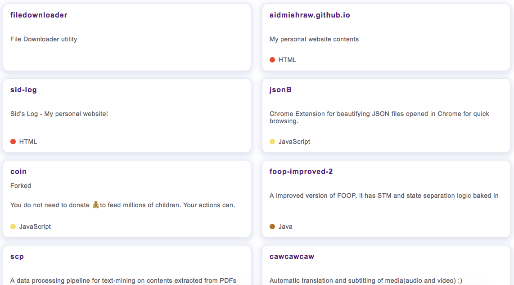

# gitHubLike

---

`gitHubLike` is a library that provides GitHub repository cards for a user using *React.js*



---

### Usage:

`gitHubLike` library exposes the following JS objects:

* `GitHubCards`: This object exposes 2 methods `render` and `getMyLanguages`.
    
    * `render`: The render method has the signature
      `render(userName, elementId, callback)` where `userName` is the name of the user whose GitHub repositories are to be fetched. `elementId` is the ID of the DOM element(div) within which *React* will render the components. `callback` is the callback function that gets executed after the component has been rendered to the screen.
    
    * `getMyLanguages`: This method fetches the names of all the languages used in the user's GitHub repositories. Should be used in the callback function passed to the render method.

* `GitHubLangColors`: This object provides all the colors associated with languages on GitHub.

---

An example usage would be(the code is taken from my personal blog(https://sidmishraw.github.io):

```html
<script src="/js/github-like.bundle.js"></script>
```

and

```js
githubLike.GitHubCards.render("sidmishraw", "projectsList", () => {
    /// WIP, will make a language carousel thingy
    jQuery("#languagesIDabbleIn").html(
      `<ol class="pinned-repos-list mb-4">` +
      githubLike.GitHubCards.getMyLanguages() +
      `</ol>`
    );
    /// WIP, will make a language carousel thingy
    stopLoader();
  });
```

---

### Dependencies:

* [jQuery](https://unpkg.com/jquery@3.2.1/dist/jquery.js)

* [react](https://unpkg.com/react@16.0.0/umd/react.production.min.js)

* [react-dom](https://unpkg.com/react-dom@16.0.0/umd/react-dom.production.min.js)

`Tested with react(v16.0.0), react-dom(v16.0.0) and jQuery(v3.2.1)`

> Note: Add `react.js` before adding `react-dom.js` to the `<head>` tag in `<script>` tags because `react` needs to be loaded before `react-dom`.


---

### Building from source:

* Install `yarn`. You can download it from [here](https://yarnpkg.com/en/).

* Clone the repository and then run:

```sh
yarn install
```

* `yarn` will download and install all the dependencies. After it has installed all the dependencies

* Run the following commands for running the test server and build respectively:

```sh
yarn start --watch  # this runs the development test server by using webpack-dev-server

yarn build          # bundles everthing to the `bin` directory
```

* Copy and use the `github-like.bundle.js` inside the `bin` directory. Add it to your html file or use it as a library :)

---

> Note: Do use the `styles.css` with `github-like.bundle.js`

---


`- Sid`